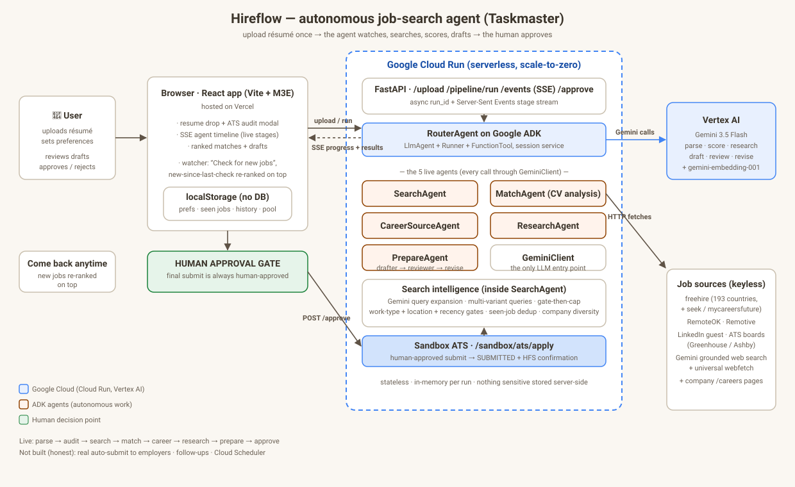

# Hireflow

Autonomous AI job-search agent for **All Things Agentic Hackathon 2026** (Taskmaster track).

> *"The agent never waits to be asked. It watches, decides, and acts — the human only approves."*

by ar-Raqmi and Izaaz

## What it is

Hireflow is a **watcher**, not a chatbot. Upload your résumé and set your work-type, location, and role preferences. Five AI agents then take over the messy multi-step chore of job hunting: they will search a global registry of keyless job sources, expand your target roles into synonym queries, score every job boards against your résumé, probe the matched companies' own careers pages for missed jobs boards, research the companies, and draft a CV + cover letter for top 5 job boards that matches with your resume.

Come back anytime and hit **"Check for new jobs"** — the agent re-runs, and every role that appeared **since your last check is re-ranked on top** with a NEW badge. You decide which applications to pursue. The **final submission is intentionally human-gated**: most job boards are anti-bot/Cloudflare-locked and applying on your behalf is not something an agent should do silently — so Hireflow does everything autonomously up to the last click, then the human approves.

**Live (hosted for judging):**

| | URL |
|---|---|
| Vercel app | https://hireflow-pi-five.vercel.app |
| Cloud Run backend | https://hireflow-backend-296941301245.us-central1.run.app (`/health`, `/docs`) |

## Architecture



The live pipeline runs as eight SSE-streamed stages: `parse → audit → search → match → career → research → prepare → approve`.

## Repo map

```
├── clients/            # thin terminal clients of the DEPLOYED api (nothing runs locally)
│   ├── hireflow.sh     #   bash driver (prompts, curls the live url, exports result-demo.html)
│   ├── hireflow.bat    #   windows double-click driver
│   └── hireflow_run.py #   cross-platform logic shared by the two above
├── docs/
│   ├── architecture.svg    # the diagram above
│   ├── CURL_E2E.md         # exact curl acceptance playbook against the live url
│   ├── DEPLOY.md           # one-command Cloud Run deploy
│   ├── GCP_SETUP.md        # one-time GCP runbook (apis, IAM, embeddings)
│   └── VIDEO_SCRIPT.md     # ≤4-min demo video storyboard
├── frontend/           # vite + react app (m3e components) — the real ui, calls the live backend
├── hireflow/           # fastapi backend
│   ├── api/app.py      #   /upload /pipeline/run(+SSE) /approve /sandbox/ats
│   ├── agents/         #   router.py (5 agents), adk_router.py (Google ADK graph), career_source.py
│   ├── tools/          #   gemini client, job sources (freehire/remoteok/remotive/linkedin/ats),
│   │                   #   query expander, webfetch + grounded search, geo/location mapper
│   ├── domain/         #   typed models (Profile, JobPosting, Application, ResumeFinding)
│   └── storage/        #   in-memory repository (stateless; browser owns persistence)
├── prototype/          # retired clickable html mock (reference only)
├── Dockerfile          # python:3.11-slim → uvicorn :8080 (cloud run)
└── RULES.md            # official hackathon rules (source of truth)
```

## Run it

**Option A — just use the hosted app (judges):** open https://hireflow-pi-five.vercel.app, drop a résumé, follow the timeline.

**Option B — frontend locally** (talks to the deployed Cloud Run backend):

```bash
cd frontend
npm install
npm run dev        # /api/* proxied to VITE_HIREFLOW_API (default: the live Cloud Run url)
```

**Option C — backend locally:**

```bash
pip install -r requirements.txt
# Vertex path (recommended): point GOOGLE_APPLICATION_CREDENTIALS at a service
# account with roles/aiplatform.user, then set GCP_PROJECT_ID + GEMINI_USE_VERTEX=true.
# Gemini-API fallback: set GEMINI_API_KEY.
uvicorn hireflow.api.app:app --port 8080
curl -s localhost:8080/health   # {"status":"ok"}
```

**Option D — deploy your own Cloud Run instance** (one command, full IAM notes in `docs/DEPLOY.md`):

```bash
gcloud run deploy hireflow-backend --region us-central1 --source . \
  --allow-unauthenticated --memory 4Gi --cpu 2 --timeout 3600
```

**Terminal client** (online-only thin client of the deployed api):

```bash
clients/hireflow.sh                 # prompts + streams live SSE progress
python -m hireflow.cli ./resume.pdf --work-type hybrid --location "Kuala Lumpur"
```

## What is real (verified 2026-08-30, live on the deployed Cloud Run)

- **The full pipeline ran end-to-end on the `.run.app` url** — a real run streamed `parse → audit → search → match → career → research → prepare → approve` and returned 10 ranked matches with drafts; `/approve` submitted to the sandbox ATS (`SUBMITTED` + `HFS-…` confirmation).
- **Real Gemini 3.5 Flash via Vertex AI** — every agent calls the same `GeminiClient` (the only LLM entry point; no mocks or stubs). Résumé parsing is real Gemini (text, or vision via PyMuPDF page renders when text is thin), and uploads are gated by an AI résumé-classifier + ATS-health audit.
- **Search is an agent, not a keyword matcher** — Gemini query expansion per role, multiple query variants per source, then gate-then-cap: work-type + location + recency gates, cross-run seen-job dedup (driven by your browser), per-company diversity cap.
- **Global keyless source registry** (curl-verified): freehire (193 countries + `seek`/`mycareersfuture` regional relays), RemoteOK, Remotive, LinkedIn guest, ATS boards (Greenhouse, Ashby), plus Gemini **grounded web search** + universal webfetch as the catch-all layer. Dead sources (Lever, Workable) are coded but disabled, not claimed.
- **React frontend verified in-browser against the real backend** — SSE timeline animates from the live stream; watcher ux (new-since-last-check re-ranking, "check for new jobs") works against real runs.

Reproduce the proof yourself: `docs/CURL_E2E.md` is the exact curl sequence (health → upload → run → SSE → approve) against the live url.

## Design decisions worth a look (judges' cliff notes)

- **Client-owned persistence, stateless backend.** No database anywhere: preferences, seen-job memory, and history live in browser `localStorage`, so Cloud Run can scale to zero between checks. The watcher model survives server restarts because the *browser* remembers.
- **Gate-then-cap before paying for scoring.** Every discovered job passes work-type/location/recency gates and a per-company diversity cap *before* any Gemini scoring call — the agent controls cost instead of scoring everything it finds.
- **Deterministic ADK orchestration.** The `HireflowAgent` graph (`adk_router.py`) wraps the multi-agent `RouterAgent` as a single ADK `FunctionTool` injected via `before_model_callback` — the ADK Runner, session service, and tool dispatch execute on every run without wasting a round-trip on an orchestrator LLM call.
- **Honesty as a feature.** Submission is sandboxed (demo ATS), follow-ups and scheduled runs are not built, and disabled/dead job sources are labeled as such. The agent's autonomy stops exactly where impersonating a human would begin.

## Limitations (what's *not* built)

- No real auto-submission to employers (sandbox ATS only) — by design.
- No follow-up emails/tracking, no Cloud Scheduler polling.
- Backend is stateless in-memory: job history beyond the current run lives in the browser only.
- Playwright that can pass Cloudflare/anti-bot is not built.

## Stack

Gemini 3.5 Flash (Vertex AI) · Google ADK (Python) · FastAPI · Cloud Run · Vite + React (@m3e/react Material 3 Expressive) · PyMuPDF / pypdf / python-docx

## Hackathon compliance (RULES.md)

| Requirement | Status |
|---|---|
| Gemini 3.5+ via Gemini API/Vertex AI | ✓ Vertex AI primary, `gemini-3.5-flash` |
| Google Agent Framework | ✓ Google ADK (`adk_router.py`, live in every run) |
| Google Cloud infrastructure | ✓ Cloud Run (scale-to-zero) + Vertex AI |
| Hosted public URL | ✓ backend `.run.app` + frontend Vercel |
| Spin-up instructions | ✓ this readme (options A–D) |
| Architecture diagram | ✓ `docs/architecture.svg` |
| Demo video ≤4 min | storyboard ready (`docs/VIDEO_SCRIPT.md`) — recording in progress |
| Repo access for judging | grant `testing@devpost.com` + `cloudhackathons@google.com` before submitting |
